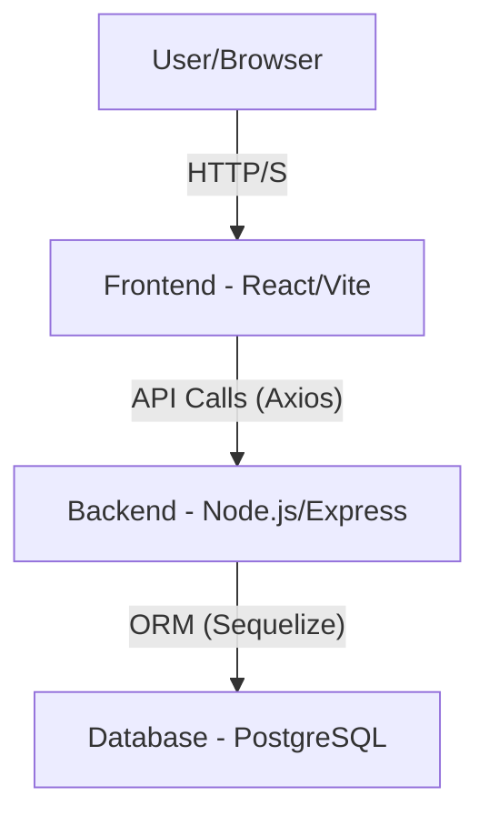

## 📄 README.md

# Colbin Recruitment Platform Prototype

*A full-stack web application designed for the Full Stack Developer role at Colbin.*

## Table of Contents

- [Colbin Recruitment Platform Prototype](#colbin-recruitment-platform-prototype)
  - [Project Overview](#project-overview)
  - [Features](#features)
  - [Architecture](#architecture)
    - [Backend (Node.js/Express/TypeScript)](#backend-nodejs-expresstypescript)
    - [Frontend (React/TypeScript/Vite)](#frontend-reacttypescriptvite)
    - [Database (PostgreSQL)](#database-postgresql)
  - [Getting Started](#getting-started)
    - [Prerequisites](#prerequisites)
    - [Environment Variables](#environment-variables)
    - [Local Development](#local-development)
  - [API Endpoints](#api-endpoints)
    - [Authentication](#authentication)
  - [Deployment](#deployment)

-----

## Project Overview

This is a robust, full-stack web application prototype built to fulfill the Full Stack Developer assignment for Colbin. The project demonstrates a secure user authentication system and a simple user profile page, focusing on clean code, informed architectural decisions, and an efficient developer experience.

## Features

  - **User Authentication:** Secure signup and login for users using JWT.
  - **User Profile:** A protected page for authenticated users to view their profile.
  - **Type-Safe Development:** End-to-end type safety using TypeScript.
  - **Modern Tech Stack:** Utilizes a modern, scalable stack including Node.js, Express, React, and PostgreSQL.

## Architecture

The application follows a standard client-server architecture with a clear separation of concerns.

### Backend (Node.js/Express/TypeScript)

The backend is a RESTful API built with **Node.js**, **Express.js**, and **TypeScript**. It handles user authentication and serves protected user data.

  - **Framework**: Express.js
  - **Language**: TypeScript
  - **ORM**: Sequelize (for PostgreSQL interaction)
  - **Authentication**: JWT (JSON Web Tokens)

### Frontend (React/TypeScript/Vite)

The frontend is a modern single-page application (SPA) developed with **React.js**, powered by **Vite** for a fast development experience. It consumes the backend APIs to manage user flow and display data.

  - **Framework**: React.js
  - **Build Tool**: Vite
  - **State Management/Data Fetching**: Tanstack Query
  - **Language**: TypeScript
  - **HTTP Client**: Axios

### Database (PostgreSQL)

**PostgreSQL** is used as the relational database to store user credentials and profile details. **Sequelize** facilitates seamless interaction between the Node.js backend and the database.

  - **Type**: Relational Database
  - **Tooling**: Sequelize ORM

-----

## ⚙️ Getting Started

Follow these instructions to get a copy of the project up and running on your local machine for development and testing purposes.

### Prerequisites

  - Node.js (LTS recommended)
  - npm (comes with Node.js)
  - PostgreSQL
  - Git

### Environment Variables

Create a file named `.env` in the `backend/` directory with the following content.

```
PORT=3002
DATABASE_URL="postgresql://postgres:{password}@{hostaddress}:5432/{database}" # Your external RDS URL
JWT_SECRET='your_strong_jwt_secret_key' # Replace with a strong, random string
```

### Local Development

1.  Clone the repository:

    ```bash
    git clone git@github.com:zeyakarim/colbin-recruitment-platform-prototype.git
    ```

2.  **Backend Setup:**
    Navigate into the `backend` directory:

    ```bash
    cd backend
    ```

    Install dependencies and start the server:

    ```bash
    npm install
    npm run dev
    ```

    The backend should start on `http://localhost:3002`.

3.  **Frontend Setup:**
    Open a new terminal and navigate into the `frontend` directory:

    ```bash
    cd frontend
    ```

    Install dependencies and start the server:

    ```bash
    npm install
    npm run dev
    ```

    The frontend should start on `http://localhost:5173`.

## API Endpoints

The backend exposes the following RESTful API endpoints:

### Authentication

  - `POST /api/auth/register`: Register a new user.
      - **Request**: `{ "email", "password" }`
      - **Response**: `{ "message": "User registered successfully", "userId": 1 }`
  - `POST /api/auth/login`: Authenticate a user and receive a JWT.
      - **Request**: `{ "email", "password" }`
      - **Response**: `{ "message": "Logged in successfully", "token": "jwt_token" }`
  - `GET /api/user/profile`: Get the current authenticated user's profile details.
      - **Headers**: `Authorization: Bearer <JWT_TOKEN>`
      - **Response**: `{ "profile": { ... } }`

## Deployment

The project is structured for easy deployment to cloud services.

  - **Frontend**: Can be deployed to platforms like **Vercel** or **Netlify**.
  - **Backend**: Can be deployed to container-based services like **AWS ECS** or PaaS providers like **Render**.
  - **Database**: Can be hosted on a managed service like **AWS RDS** or **Google Cloud SQL**.

-----

## Architecture Diagram


